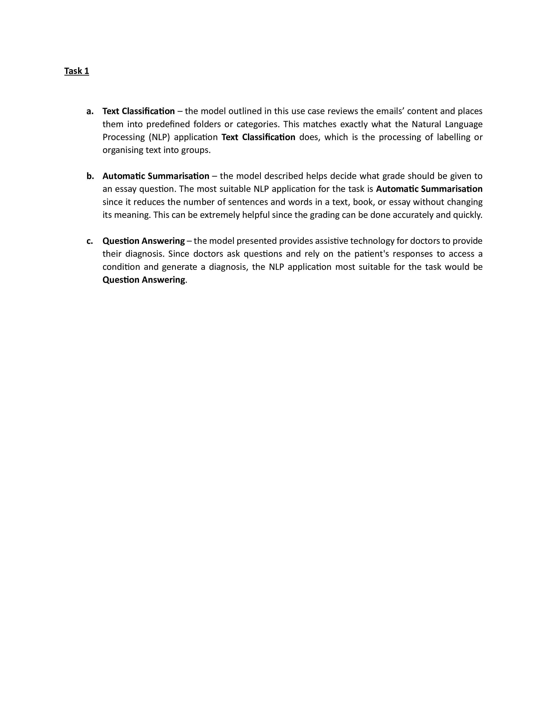
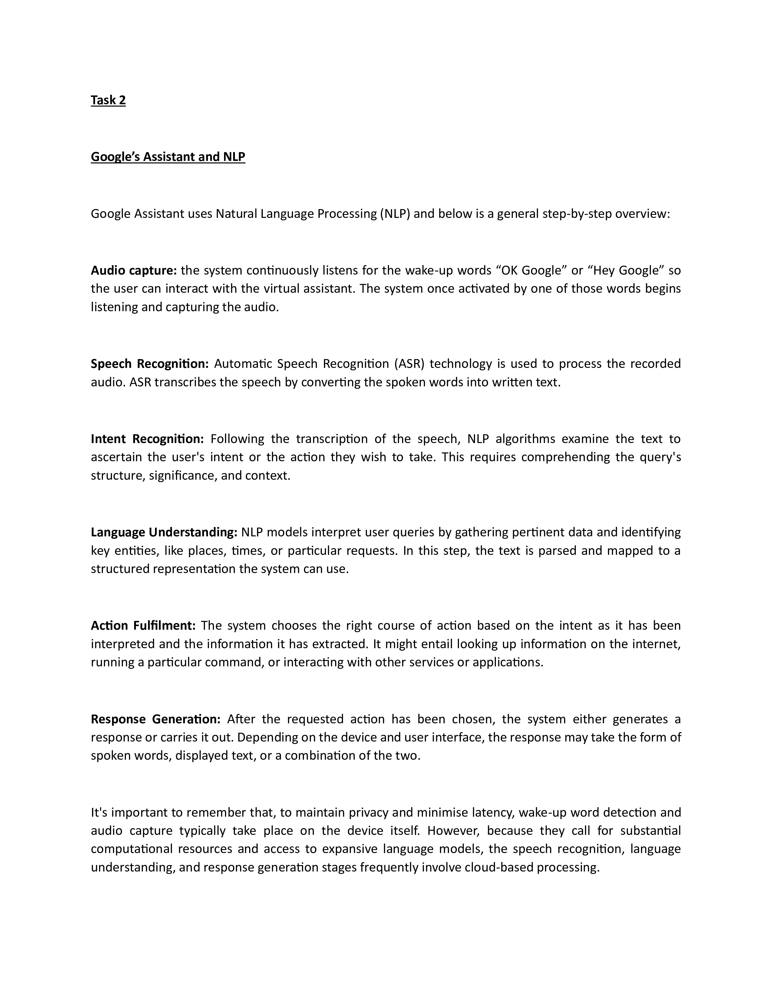
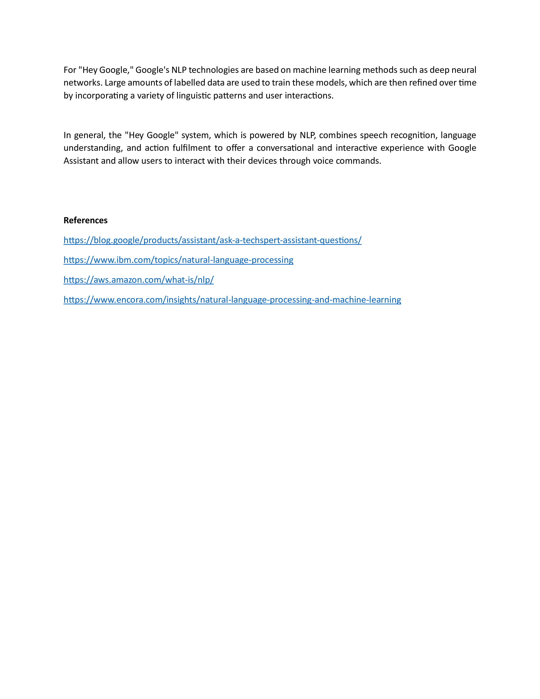

# Table of Contents

  * [Capstone Project Header](#capstone-project---natural-language-processing-nlp)
    * [Task 1](#task-1)
        * [Project Name](#project-name)
        * [Project Description](#project-description)
        * [Project Installation](#project-installation)
        * [Project Instructions](#project-instructions)
            * [Screenshots](#screenshots)
        * [Credits](#credits)
    * [Task 2](#task-2)
        * [Project Name](#project-name-1)
        * [Project Description](#project-description-1)
        * [Project Installation](#project-installation-1)
        * [Project Instructions](#project-instructions-1)
            * [Screenshots](#screenshots-1)
        * [Credits](#credits-1)

# Capstone Project - Natural Language Processing (NLP)

This project is divided into two Tasks:

## Task 1

### Project Name

The name of this project is Categorising NLP Applications.

### Project Description

This project does not include any code however it categorises the type of NLP application that applies to each one of the examples below: 

* **a)** A model that allocates which mail folder an email should be sent to
(work, friends, promotions, important), like Gmail’s inbox tabs.

* **b)** A model that helps decide what grade to award to an essay question.
This can be used by a university professor who grades a lot of classes
or essay competitions.

* **c)** A model that provides assistive technology for doctors to provide
their diagnosis. Remember, doctors ask questions, so the model will
use the patients’ answers to provide probable diagnosis for the
doctor to weigh and make decisions.

This project is important since it shows how day-to-day life situations can be easily carried out with the help of technology in the particular cases by NLP applications.

### Project Installation

Please open the file by clicking on "nlp_1.pdf" on the file section of the "finalCapstone" repository and the file will open and its contents will be immediately available. Once the file has opened you will also have an option of downloading a copy of the file into your computer. In this instance you will need a pdf reader like [Adobe Reader](https://get.adobe.com/uk/reader/) to open the file.

### Project Instructions

There are no relevant instructions for this project since the content is immediately available.

#### **Screenshots:**

### Credits

No credits are given on this task.

## Task 2

### Project Name

The name of this project is Google’s Assistant and NLP.

### Project Description

This project does not include any code however it focus in the use of NLP on innovative technologies (by companies such as Google or IBM, for instance). It provides a general step-by-step overview how Google Assistant uses Natural Language Processing (NLP).

This project is important since it shows how humans can interact with technology with the help of combined NLP applications to carry out day-to-day tasks.

In general, the "Hey Google" system, which is powered by NLP, combines speech recognition, language understanding, and action fulfilment to offer a conversational and interactive experience with Google Assistant and allow users to interact with their devices through voice commands.

### Project Installation

Please open the file by clicking on "nlp_1.pdf" on the file section of the "finalCapstone" repository and the file will open and its contents will be immediately available. Once the file has opened you will also have an option of downloading a copy of the file into your computer. In this instance you will need a pdf reader like [Adobe Reader](https://get.adobe.com/uk/reader/) to open the file.

### Project Instructions

There are no relevant instructions for this project since the content is immediately available.

#### **Screenshots:**

### Credits

[Google Blog](https://blog.google/products/assistant/ask-a-techspert-assistant-questions/)

[IBM NLP](https://www.ibm.com/topics/natural-language-processing)

[Amazon AWS](https://aws.amazon.com/what-is/nlp/)

[Encora](https://www.encora.com/insights/natural-language-processing-and-machine-learning)